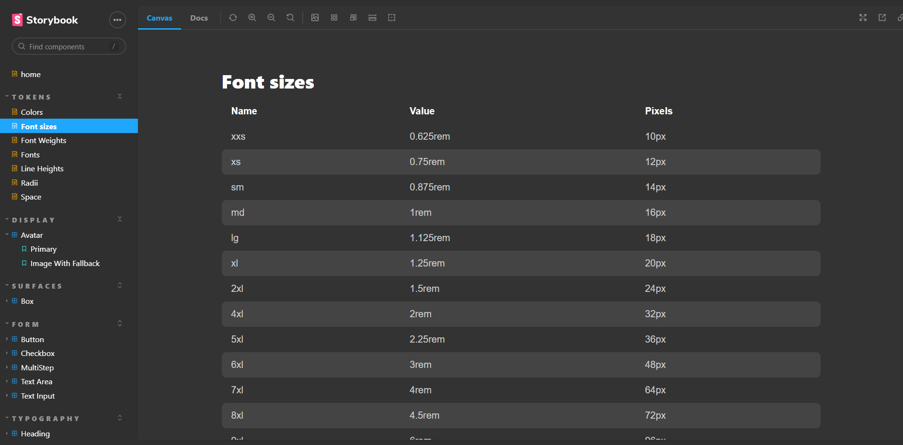

# Desing System - Ignite Call



> Trilha Ignite

Este Design System foi desenvolvido através de um desafio Rocketseat, onde o objetivo era criar um Design System para uma futura aplicação usando Storybook, com isso todos os componentes e tokens (fontes, cores, espaçamentos...) da aplicação foram documentados dentro deste ecossistema, cada um com a sua peculiaridade.

This Design System was developed through a Rocketseat challenge, where the objective was to create a Design System for a future application using Storybook, with that all components and tokens (fonts, colors, spacing...) of the application were documented within this ecosystem , each with its own peculiarity.

## 🛠 Technologies

- React
- TypeScript
- Stitches CSS
- Storybook
- Turbo Repo

## 🧑‍💻 Applications

- Documentation of components in the Storybook
- Props
- Components
- Variants
- CI/CD

## 🪄 How to use?

### Abra o terminal e copie este repositório em alguma pasta com o comando | Open terminal and copy this repository at some dir with the comand
```
$ git clone https://github.com/lucadboer/ds-ignite-call.git
```

### Acesse a pasta do projeto no prompt de comando ou pelo mouse | Access dir of the project in cmd or by mouse

```
$ ds-ignite-call
```

### Instale as dependências da aplicação | Install the dependecies of the application

```
$ npm install
or
$ yarn install
```

### Execute a aplicação | Run the application * this part takes a while in the first run *

```
$ npm run dev
or
$ yarn run dev
```

## 💛 Contact

- Email --> luca.boer@outlook.com
- Linkedin --> https://www.linkedin.com/in/luca-destefano-boer/
- Portfolio --> https://about-luca.vercel.app/
